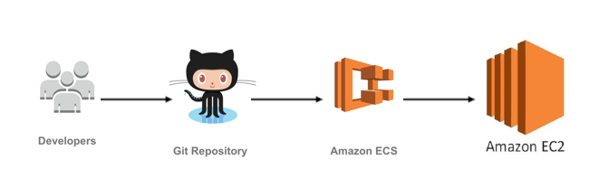

# Mutant Validator

API para validar si una cadena de ADN es mutante, provee un endpoint para validación y otro para obtener las estadísticas de las validaciones  
 * URL -> [http://localhost:9090/swagger-ui.html](http://localhost:9090/swagger-ui.html) 

## Ejecutar localmente
Esta aplicación usa spring boot, puede ser ejecutada fácilmente con el siguiente comando
``` angularjs
 mvn spring-boot:run
 ```

una vez desplegada la aplicación se puede acceder usando el link [http://localhost:9090/swagger-ui.html](http://localhost:9090/swagger-ui.html)

## Uso de la aplicacion
A continuación se explicaran los endpoint de la aplicacion y se darán ejemplos de uso

1. [POST detector/mutant](http://localhost:9090/webjars/swagger-ui/index.html?configUrl=/v3/api-docs/swagger-config#/detector-controller/isMutant) Valida si una cadena de ADN pertenece a un mutante o no 
      1. Parámetros de entrada: Body Request que contiene la cadena de ADN.
         ``` angularjs
         {"dna": ["ATCA"], ["ATCA"], ["ATCA"], ["ATCA"] }
         ```
      2. Códigos de respuesta:
         1. ``` 200 OK. ``` Si el adn es mutante
         2. ```403 Forbidden.``` Si el adn es humano
         3. ```400 Bad Request.``` Si los parametros son invalidos
         <br /><br />
      3. Curl de ejemplo
          ``` angularjs
          curl --location --request POST 'http://localhost:9090/detector/mutant' \
          --header 'accept: */*' \
          --header 'Content-Type: application/json' \
          --data-raw '{
              "dna": [
                  "CTAC",
                  "CAAT",
                  "TAAT",
                  "AGAA"
              ]
          }'
           ```
2. [GET stats/verification](http://localhost:9090/webjars/swagger-ui/index.html?configUrl=/v3/api-docs/swagger-config#/stats-controller/getVerificationStats)
Obtiene las estadísticas de las verificaciones de ADN
   1. Ejemplo de respuesta:
      ``` angularjs
      {"count_mutant_dna": 0, "count_human_dna": 1, "ratio": "0.0"}
      ```
    2.  Curl de ejemplo
      ``` angularjs
       curl --location --request GET 'http://localhost:9090/stats/verification' \
       --header 'accept: application/json'
      ```
      
## CI/CD

1. [Mutation y Unit Test](https://github.com/wilferac/mutantTest/actions/workflows/pitest.yml) archivo _**_pitest.yml_**_ 
   <br />Es encargado de ejecutar unit test y mutation test,
   el job genera un artefacto con los resultados de la ejecución, donde encontraremos los resultados del mutation test y el coverage del código
2. [Deploy to Amazon](https://github.com/wilferac/mutantTest/actions/workflows/aws.yml) archivo _**_aws.yml_**_
      <br />Es encargado de desplegar la aplicación en AWS en una instancia EC2, se ejecuta cada vez que se crea un release
3. [Jmeter Test](https://github.com/wilferac/mutantTest/actions/workflows/jmeter.yml) archivo _**_jmeter.yml_**_
   <br />Es encargado ejecutar pruebas de carga sobre la aplicación desplegada en AWS, el job genera un artefacto con los resultados de la ejecución.  

## AWS Flow 
Cuando se crea un release, un Action definido en Gitlab crea una imagen docker la cual es enviada a un cluster ECS que a su vez despliega una instancia EC2,
el cluster ECS se encarga mantener la instancia EC2 arriba brindando alta disponibilidad a la aplicación en caso de algún crash de la misma



## Reactive con Reactor
Esta aplicación hace uso del [paradigma reactivo](https://en.wikipedia.org/wiki/Reactive_programming), lo cual ayuda al procesamiento de grandes cantidades de datos y a mantener un código limpio evitando la necesidad de usar Threads para conseguir un gran rendimiento.
## Technologies and Design
* Java 11
* Reactor, full reactive API
* Domain Driven Design
* Spring boot
* Swagger
* Junit - Mockito
* Pitest (mutation test)
* Jmeter (load testing)
* SOLID: Dependency inversion, Single responsibility and Interface segregation
* CI/CD with GitHub actions
